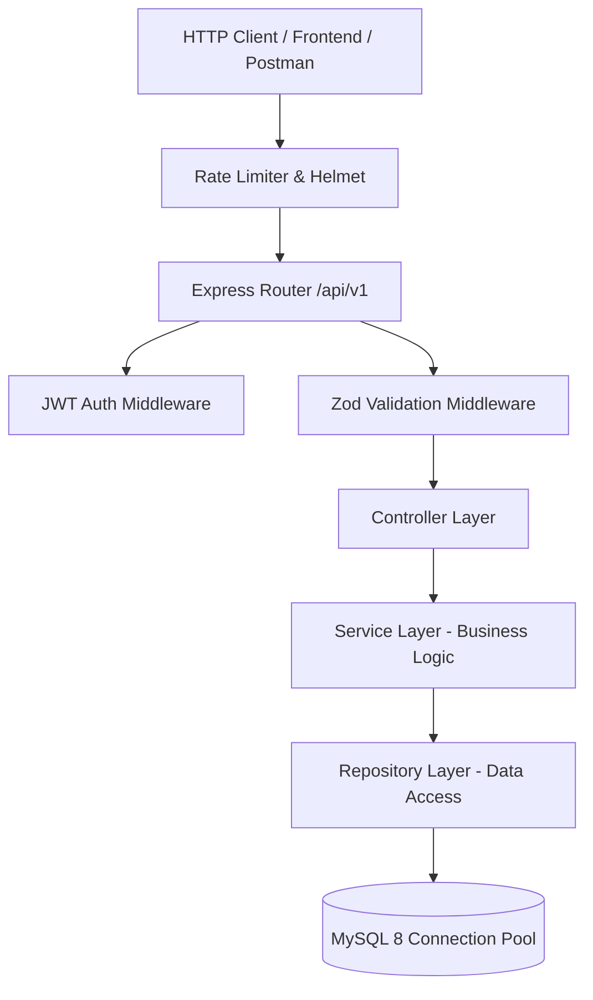
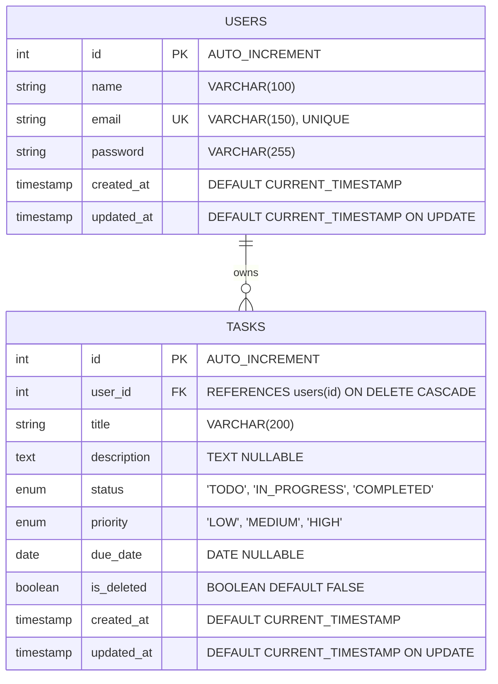

<p align="center">
  <h1 align="center">🚀 Production-Grade Task Manager REST API</h1>
  <p align="center">
    <strong>A high-performance, enterprise-ready RESTful API built with Node.js, Express, TypeScript, and MySQL.</strong>
  </p>
  <p align="center">
    <a href="#-key-features">Features</a> •
    <a href="#-architecture--system-design">Architecture</a> •
    <a href="#-database-design">Database</a> •
    <a href="#-quick-start">Quick Start</a> •
    <a href="#-api-documentation--curl-examples">API Docs</a> •
    <a href="#-automated-testing">Testing</a> •
    <a href="#-راهنمای-فارسی">راهنمای فارسی</a>
  </p>
</p>

<p align="center">
  
  
  
  
  
  
  
  
</p>

---

## 📖 Table of Contents
1. [Introduction & Problem Statement](#-introduction--problem-statement)
2. [Key Features](#-key-features)
3. [Architecture & System Design](#-architecture--system-design)
4. [Tech Stack](#-tech-stack)
5. [Database Design](#-database-design)
6. [Security & Engineering Standards](#-security--engineering-standards)
7. [Quick Start](#-quick-start)
   - [Option A: Docker Compose (Recommended)](#option-a-run-with-docker-compose-recommended)
   - [Option B: Local Machine Setup](#option-b-local-machine-setup)
8. [Environment Variables](#-environment-variables)
9. [API Documentation & cURL Examples](#-api-documentation--curl-examples)
10. [Automated Testing](#-automated-testing)
11. [How to Push to Your GitHub](#-how-to-push-to-your-github)
12. [راهنمای فارسی پروژه (Persian Guide)](#-راهنمای-فارسی)
13. [License](#-license)

---

## 💡 Introduction & Problem Statement

This project was built to demonstrate **production-grade backend engineering** following industry standards (such as **Xendit**, FinTech, and enterprise SaaS platforms).

Many junior-to-mid tutorials build CRUD APIs with raw Express route files mixed with database logic, lack strict runtime validations, ignore data isolation between users, and omit SQL injection prevention or health check routines.

This project solves that by demonstrating:
- **Clean Layered Architecture (N-Tier)** separating business logic from transport and persistence layers.
- **Fail-Fast Request Validation** with Zod before payloads ever reach service handlers.
- **Bulletproof SQL Security** utilizing parameterized queries via `mysql2/promise` connection pools.
- **Tenant/User Isolation**: Every task operation guarantees ownership verification.
- **Observability & Resilience**: Health checks, graceful shutdowns (`SIGTERM`/`SIGINT`), and structured logging.

---

## 🌟 Key Features

- **🏛️ Layered Clean Architecture**: Strict decoupling between Routes, Controllers, Services, Repositories, and the Database layer.
- **🛡️ Strict Type-Safety & Validation**: 100% strict TypeScript mode (`noImplicitAny`, `strictNullChecks`) combined with **Zod** schema validation for `body`, `query`, and `params`.
- **🔐 Enterprise Authentication**:
  - Stateless JWT authentication with expiration.
  - Salted password hashing with `bcryptjs` (10 rounds).
  - Fine-grained data authorization ensuring users only view and modify their own tasks.
- **⚡ Advanced Task CRUD Operations**:
  - **Pagination**: Offset-based pagination with complete metadata (`page`, `limit`, `total`, `totalPages`, `hasNextPage`, `hasPrevPage`).
  - **Dynamic Filtering**: Filter tasks by status (`TODO`, `IN_PROGRESS`, `COMPLETED`) and priority (`LOW`, `MEDIUM`, `HIGH`).
  - **Full-Text Search**: Keyword matching across task titles and descriptions.
  - **Multi-Field Sorting**: Order by `created_at`, `due_date`, `priority`, or `title` in `ASC` or `DESC` order.
  - **Soft & Hard Deletion**: Default soft-deletion (`is_deleted = TRUE`) with optional permanent purge (`?hard=true`).
- **📊 Productivity Analytics & Metrics**: Endpoint (`GET /api/v1/tasks/stats/summary`) calculating completed tasks, tasks in progress, high-priority counts, and overdue tasks.
- **📖 Interactive OpenAPI / Swagger UI**: Built-in interactive documentation available directly in the browser at `/api/docs`.
- **🛡️ Battle-Tested Security Middlewares**:
  - `helmet`: Protects against well-known web vulnerabilities by setting appropriate HTTP headers.
  - `cors`: Configured Cross-Origin Resource Sharing.
  - `express-rate-limit`: Prevents brute-force and DDoS attacks (100 requests per 15-minute window by default).
- **🐳 One-Click Docker Environment**: `docker-compose.yml` spins up MySQL 8 and the Node.js API together with zero manual configuration.
- **🧪 Automated Test Coverage**: Integration tests built with **Jest** and **Supertest** covering validation, authentication guards, health checks, and 404 handling.

---

## 🏛️ Architecture & System Design

The application follows the **Repository & Service Pattern (Layered Clean Architecture)**:



### Directory Structure

```
Task Manager REST API/
├── src/
│   ├── app.ts                  # Express application setup, security middlewares & docs
│   ├── server.ts               # Server bootstrap, DB startup & graceful shutdown
│   ├── config/
│   │   ├── env.ts              # Zod-validated environment schema & variables
│   │   └── swagger.ts          # OpenAPI / Swagger JSDoc configuration
│   ├── database/
│   │   ├── connection.ts       # MySQL2 connection pool & health checks
│   │   ├── init.ts             # Automated database & table migrations
│   │   └── seed.ts             # Demo user & sample tasks seeder
│   ├── models/
│   │   ├── user.model.ts       # User entity interfaces & DTOs
│   │   └── task.model.ts       # Task entity, enums, filters & stats types
│   ├── schemas/
│   │   ├── auth.schema.ts      # Zod validation schemas for register & login
│   │   └── task.schema.ts      # Zod validation schemas for task CRUD & queries
│   ├── middlewares/
│   │   ├── auth.middleware.ts  # JWT Bearer token validation & req.user injection
│   │   ├── error.middleware.ts # Centralized error handler (404, Zod, MySQL codes)
│   │   ├── rateLimiter.ts      # Rate limiting defense
│   │   └── validate.middleware.ts # Generic Zod schema validation middleware
│   ├── repositories/
│   │   ├── user.repository.ts  # User SQL queries with parameterized statements
│   │   └── task.repository.ts  # Task SQL queries with dynamic filters & stats
│   ├── services/
│   │   ├── auth.service.ts     # User registration, authentication & JWT issuance
│   │   └── task.service.ts     # Task business logic, pagination & calculations
│   ├── controllers/
│   │   ├── auth.controller.ts  # Auth route request/response handlers
│   │   └── task.controller.ts  # Task route request/response handlers
│   ├── routes/
│   │   ├── index.ts            # Master API router (/api/v1)
│   │   ├── auth.routes.ts      # Authentication endpoints
│   │   └── task.routes.ts      # Task endpoints
│   └── utils/
│       ├── apiResponse.ts      # Standardized JSON response envelope
│       ├── errors.ts           # Custom HTTP operational error classes
│       └── logger.ts           # Structured logging utility
├── tests/
│   ├── api.test.ts             # Health check & Swagger endpoints tests
│   └── auth.test.ts            # Auth validation & security tests
├── Dockerfile                  # Production multi-stage Docker build
├── docker-compose.yml          # Multi-container orchestration (MySQL + API)
├── .env.example                # Sample environment configuration
├── tsconfig.json               # TypeScript strict configuration
└── package.json                # Dependencies & scripts
```

---

## 🛠️ Tech Stack

| Category | Technology | Purpose |
| :--- | :--- | :--- |
| **Runtime** | Node.js (v20+) | High-performance asynchronous JavaScript engine |
| **Language** | TypeScript (v5.7+) | Strict static typing and enhanced developer tooling |
| **Framework** | Express.js (v4.21+) | Lightweight, minimalist web framework |
| **Database** | MySQL 8.0 | Relational database with indexing, constraints, and pooling |
| **Database Driver**| `mysql2/promise` | Native asynchronous Promise-based MySQL client with connection pooling |
| **Validation** | Zod (v3.24+) | TypeScript-first schema declaration and runtime validation |
| **Security** | `helmet`, `bcryptjs`, `jsonwebtoken`, `express-rate-limit` | Password hashing, token security, rate limiting, and HTTP header hardening |
| **Documentation**| `swagger-ui-express`, `swagger-jsdoc` | Interactive OpenAPI 3.0 specification |
| **Testing** | Jest, `ts-jest`, Supertest | Unit and integration testing |
| **DevOps** | Docker, Docker Compose | Containerized reproducible deployments |

---

## 🗄️ Database Design

### Entity Relationship Diagram (ERD)



### Table Indexes & Optimization
- **`users`**:
  - `idx_users_email`: B-Tree index for $O(1)$ user lookups during authentication.
- **`tasks`**:
  - `idx_tasks_user_id`: Foreign key index to rapidly query tasks per authenticated user.
  - `idx_tasks_status`: Fast index filtering for status queries (`TODO`, `IN_PROGRESS`, `COMPLETED`).
  - `idx_tasks_priority`: Optimizes priority sorting and filtering.
  - `idx_tasks_due_date`: Enables lightning-fast overdue task calculations.
  - `idx_tasks_is_deleted`: Ensures soft-deleted items are quickly filtered out.

---

## 🔒 Security & Engineering Standards

1. **SQL Injection Protection**:
   - Zero string concatenation in SQL queries. Every user input is parameterized using placeholders (`?`).
2. **Password Hashing**:
   - Passwords are encrypted with `bcryptjs` using 10 salt rounds. Passwords are automatically stripped from API responses.
3. **Stateless JWT Authentication**:
   - Signed JSON Web Tokens containing `userId` and `email` with configurable expiry (`JWT_EXPIRES_IN=7d`).
4. **Graceful Shutdown**:
   - Handles `SIGTERM` and `SIGINT` signals by closing active HTTP listeners and draining MySQL connection pool before process exit.
5. **Standardized Response Envelope**:
   - Consistent JSON format across all successful responses and error cases:
   ```json
   {
     "success": true,
     "message": "Tasks retrieved successfully",
     "data": [...],
     "meta": { "page": 1, "limit": 10, "total": 25, "totalPages": 3, "hasNextPage": true, "hasPrevPage": false },
     "timestamp": "2026-09-06T02:00:00.000Z"
   }
   ```

---

## 🚀 Quick Start

### Option A: Run with Docker Compose (Recommended)

Requires Docker & Docker Compose installed.

```bash
# 1. Clone the repository
git clone https://github.com/<your-username>/task-manager-api.git
cd task-manager-api

# 2. Build and launch MySQL & API containers
docker compose up -d --build

# 3. Seed demo data (Optional)
docker compose exec api npm run db:seed
```

- 🌐 **API Base URL**: `http://localhost:3000/api/v1`
- 📖 **Interactive Swagger UI**: `http://localhost:3000/api/docs`
- 🩺 **Health Check**: `http://localhost:3000/health`

---

### Option B: Local Machine Setup

#### Prerequisites
- **Node.js** >= 18.x
- **MySQL** >= 8.0 (running locally on port `3306`)

#### 1. Clone & Install Dependencies
```bash
git clone https://github.com/<your-username>/task-manager-api.git
cd task-manager-api
npm install
```

#### 2. Configure Environment Variables
```bash
cp .env.example .env
```
Edit `.env` to match your local MySQL credentials:
```env
DB_HOST=127.0.0.1
DB_PORT=3306
DB_USER=root
DB_PASSWORD=your_mysql_password
DB_NAME=task_manager_db
```

#### 3. Initialize Database & Tables
```bash
# Automatically creates the database and all tables with indexes
npm run db:init

# Optional: Seed sample user (demo@example.com / Password123!) & sample tasks
npm run db:seed
```

#### 4. Start Development Server
```bash
npm run dev
```

---

## ⚙️ Environment Variables

| Variable | Type | Default | Description |
| :--- | :--- | :--- | :--- |
| `NODE_ENV` | `string` | `development` | App environment (`development`, `production`, `test`) |
| `PORT` | `number` | `3000` | Port Express server listens on |
| `API_PREFIX` | `string` | `/api/v1` | Global API version prefix |
| `JWT_SECRET` | `string` | *(required)* | Secret key used to sign and verify JWT tokens |
| `JWT_EXPIRES_IN` | `string` | `7d` | Token lifetime (`1d`, `7d`, etc.) |
| `DB_HOST` | `string` | `127.0.0.1` | MySQL server host |
| `DB_PORT` | `number` | `3306` | MySQL port |
| `DB_USER` | `string` | `root` | Database username |
| `DB_PASSWORD` | `string` | `""` | Database user password |
| `DB_NAME` | `string` | `task_manager_db` | Target database name |
| `DB_CONNECTION_LIMIT`| `number` | `10` | Max simultaneous connections in pool |
| `RATE_LIMIT_WINDOW_MS`| `number`| `900000` (15 min) | Rate limit window in milliseconds |
| `RATE_LIMIT_MAX_REQUESTS`| `number`| `100` | Max requests per IP window |

---

## 📡 API Documentation & cURL Examples

Interactive Swagger documentation is available at `http://localhost:3000/api/docs`.

### 1. Register User
```bash
curl -X POST http://localhost:3000/api/v1/auth/register \
  -H "Content-Type: application/json" \
  -d '{
    "name": "Jane Doe",
    "email": "jane@example.com",
    "password": "StrongPassword123!"
  }'
```

### 2. Login & Obtain JWT Token
```bash
curl -X POST http://localhost:3000/api/v1/auth/login \
  -H "Content-Type: application/json" \
  -d '{
    "email": "jane@example.com",
    "password": "StrongPassword123!"
  }'
```
*Save the returned `token` to authorize subsequent requests.*

### 3. Get Authenticated Profile
```bash
curl -X GET http://localhost:3000/api/v1/auth/me \
  -H "Authorization: Bearer <YOUR_JWT_TOKEN>"
```

### 4. Create a Task
```bash
curl -X POST http://localhost:3000/api/v1/tasks \
  -H "Authorization: Bearer <YOUR_JWT_TOKEN>" \
  -H "Content-Type: application/json" \
  -d '{
    "title": "Implement Payment Webhook",
    "description": "Handle asynchronous payment notification callbacks from payment gateway",
    "status": "TODO",
    "priority": "HIGH",
    "due_date": "2026-09-30"
  }'
```

### 5. List Tasks (Pagination, Filter & Search)
```bash
curl -X GET "http://localhost:3000/api/v1/tasks?status=TODO&priority=HIGH&page=1&limit=10&search=Webhook" \
  -H "Authorization: Bearer <YOUR_JWT_TOKEN>"
```

### 6. Get Task Productivity Statistics
```bash
curl -X GET http://localhost:3000/api/v1/tasks/stats/summary \
  -H "Authorization: Bearer <YOUR_JWT_TOKEN>"
```

**Example Response**:
```json
{
  "success": true,
  "message": "Task statistics calculated successfully",
  "data": {
    "totalTasks": 12,
    "completedTasks": 5,
    "inProgressTasks": 4,
    "todoTasks": 3,
    "overdueTasks": 1,
    "highPriorityTasks": 4,
    "mediumPriorityTasks": 6,
    "lowPriorityTasks": 2
  },
  "timestamp": "2026-09-06T02:15:00.000Z"
}
```

### 7. Update Task
```bash
curl -X PUT http://localhost:3000/api/v1/tasks/1 \
  -H "Authorization: Bearer <YOUR_JWT_TOKEN>" \
  -H "Content-Type: application/json" \
  -d '{
    "status": "IN_PROGRESS"
  }'
```

### 8. Delete Task (Soft / Hard)
```bash
# Soft delete (default):
curl -X DELETE http://localhost:3000/api/v1/tasks/1 \
  -H "Authorization: Bearer <YOUR_JWT_TOKEN>"

# Permanent hard delete:
curl -X DELETE "http://localhost:3000/api/v1/tasks/1?hard=true" \
  -H "Authorization: Bearer <YOUR_JWT_TOKEN>"
```

---

## 🧪 Automated Testing

The project includes an automated test suite verifying route validation, security guards, and core endpoints.

```bash
# Run Jest integration tests
npm test

# Check TypeScript compiler without emitting files
npx tsc --noEmit

# Build production bundle
npm run build
```

---

## 📤 How to Push to Your GitHub

This repository is already initialized with Git on the `main` branch. Follow these steps to upload it to your personal GitHub account:

```bash
# 1. Create a new repository on GitHub (e.g. "task-manager-api") without initializing README/license.
# 2. Add your GitHub remote repository URL:
git remote add origin https://github.com/<YOUR_GITHUB_USERNAME>/task-manager-api.git

# 3. Rename branch if needed (already set to main):
git branch -M main

# 4. Push your code:
git push -u origin main
```

---

## 🇮🇷 راهنمای فارسی

این پروژه یک **Task Manager REST API** تجاری، ماژولار و بسیار تمیز است که با **Node.js**، **Express**، **TypeScript** و دیتابیس **MySQL** پیاده‌سازی شده است. ساختار پروژه کاملاً منطبق با استانداردهای شرکت‌های معتبر (مانند Xendit / FinTech) طراحی شده است تا گزینه‌ای عالی برای رزومه و مصاحبه‌های استخدامی بک‌اند باشد.

### ویژگی‌های برجسته:
- **معماری لایه‌ای تمیز (Clean Layered Architecture)**: تفکیک دقیق لایه‌های Routes ،Controllers ،Services ،Repositories و دیتابیس.
- **احراز هویت کامل با JWT و Bcrypt**: هش امن کلمات عبور و ایزوله‌سازی داده‌های تسک برای هر کاربر به صورت مستقل.
- **مدیریت پیشرفته تسک‌ها (CRUD)**: صفحه‌بندی هوشمند، فیلتر چندگانه (وضعیت، اولویت)، جستجوی متنی، مرتب‌سازی و حذف نرم (Soft Delete).
- **داشبورد آمار و آنالیز (`stats/summary`)**: محاسبه خودکار درصد تکمیل، تسک‌های با اولویت بالا و تسک‌های موعد گذشته (Overdue).
- **اعتبارسنجی قوی با Zod**: بررسی داده‌های ورودی قبل از رسیدن به لاجیک بیزینس و تولید خطاهای دقیق و استاندارد.
- **مستندات اینتراکتیو Swagger**: در دسترس در مسیر `/api/docs`.
- **آماده اجرا با Docker**: فقط با اجرای دستور `docker compose up -d` کل پروژه همراه با دیتابیس اجرا می‌شود.

### نحوه اجرا:
```bash
# ۱. نصب وابستگی‌ها
npm install

# ۲. ایجاد و مقداردهی جداول دیتابیس
npm run db:init
npm run db:seed

# ۳. اجرای سرور توسعه
npm run dev

# ۴. اجرای تست‌ها
npm test
```

---

## 📄 License

This project is licensed under the **MIT License** - see the [LICENSE](LICENSE) file for details.
